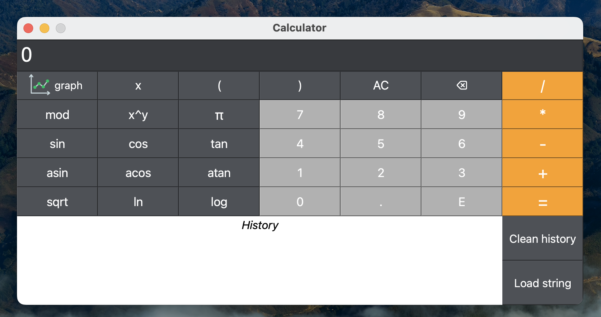

# Smart Calculator

## Project Description
Smart Calculator is an advanced version of a regular calculator, written in Python programming language. The application allows users to compute arithmetic expressions, work with parentheses, plot functions, and also includes help and calculation history functions.

### The program has the following features:
- The program code is located in the src folder.
- Google Code Style principles were used in writing the code.
- A dynamic C++ library for the Calculator "Core" was implemented.
- The "Core" model with a Python wrapper contains all the calculator's functional capabilities and can be used independently of other layers.
- Full coverage of unit tests for the methods located in the model layer.
- The application has a help section that describes the program's interface.
- The program stores the history of operations, allows loading expressions from the history, and clearing the history completely.
- The history is saved between application launches.
-  The program can accept both integers and real numbers written with a decimal point or in scientific notation.
- Evaluating arbitrary arithmetic expressions in infix notation and infix notation with variable substitution x represented by a number.
- Building a graph of a function defined by an expression in infix notation with variable x, with axes, a scale mark, and a grid with an adaptive step.
- The domain and range of functions are limited to numbers from -1000000 to 1000000.
- The checked accuracy of the fractional part is a minimum of 7 digits after the decimal point.
- The user can input up to 255 characters.

## Основные функции
The program supports the following arithmetic operations and mathematical functions:

    - **Arithmetic operators**:

      | Operator name | Infix notation   (Classic) |
      | ------ | ------ |
      | Brackets | (a + b) |
      | Addition | a + b |
      | Subtraction | a - b |
      | Multiplication | a * b |
      | Division | a / b |
      | Power | a ^ b |
      | Modulus | a mod b |
      | Unary plus | +a |
      | Unary minus | -a |

    - **Functions**:
  
      | Function description | Function |
      || ------------------- | -------- | 
      | Computes cosine | cos(x) |
      | Computes sine | sin(x) |
      | Computes tangent | tan(x) |
      | Computes arc cosine | acos(x) |
      | Computes arc sine | asin(x) |
      | Computes arc tangent | atan(x) |
      | Computes square root | sqrt(x) |
      | Computes natural logarithm | ln(x) |
      | Computes common logarithm | log(x) |

## Environment requirements
Operating system: Mac OS
Python version 3.11

## Installation and Running
To build and install the project, use the command make install. Example:

`make install DIR=my_app`

The command installs dependencies from requirements.txt, builds a dynamic library, builds an executable file, and packs it into a single application package. In the DIR parameter, specify the path where the application will be installed (default is executor).

To run the application, execute the command:

`make build`

The command builds the executable file and runs the application.

To uninstall the application, execute the command make uninstall. Example:

`make uninstall DIR=my_app`

The command deletes the build/ and \<DIR\>/ (default is executor/) directories.