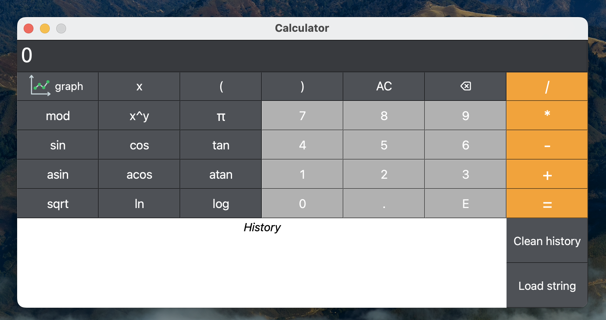

# Smart Calculator

## Описание проекта
Smart Calculator - это расширенная версия обычного калькулятора, написанная на языке программирования Python. В приложении реализована возможность вычисления арифметических выражений, работы со скобками, построения графиков функций, а также есть функции справки и истории вычислений.

### Программа имеет следующие особенности:

- Код программы находится в папке `src`.
- При написании кода были использованы принципы Google Code Style.
- Реализована динамическая библиотека на C++ для "Ядра" калькулятора.
- Модель "Ядра" с оберткой на языке Python содержит все функциональные возможности калькулятора и может использоваться без остальных слоев.
- Полное покрытие unit-тестами методов, находящихся в слое модели.
- В приложении реализован раздел справки с описанием интерфейса программы.
- Программа хранит историю операций, позволяет загружать выражения из истории и очищать историю целиком.
- История сохраняется между запусками приложения.
- На вход программы могут подаваться как целые числа, так и вещественные числа, записанные и через точку, и в экспоненциальной форме записи.
- Вычисление произвольных скобочных арифметических выражений в инфиксной нотации и в инфиксной нотации с подстановкой значения переменной _x_ в виде числа.
- Построение графика функции, заданной с помощью выражения в инфиксной нотации с переменной _x_ с координатными осями, отметкой используемого масштаба и сеткой с адаптивным шагом.
- Область определения и область значения функций ограничиваются числами от -1000000 до 1000000.
- Проверяемая точность дробной части - минимум 7 знаков после запятой.
- У пользователя есть возможность ввода до 255 символов.

## Основные функции
Программа поддерживает следующие арифметические операции и математические функции:

**Арифметические операторы**:

| Название оператора | Инфиксная нотация   (Классическая) |
| ------ | ------ |
| Скобки | (a + b) |
| Сложение | a + b |
| Вычитание | a - b |
| Умножение | a * b |
| Деление | a / b |
| Возведение в степень | a ^ b |
| Остаток от деления | a mod b |
| Унарный плюс | +a |
| Унарный минус | -a |

**Функции**:

| Описание функции | Функция |
| ---------------- | ------- |
| Вычисляет косинус | cos(x) |
| Вычисляет синус | sin(x) |
| Вычисляет тангенс | tan(x) |
| Вычисляет арккосинус | acos(x) |
| Вычисляет арксинус | asin(x) |
| Вычисляет арктангенс | atan(x) |
| Вычисляет квадратный корень | sqrt(x) |
| Вычисляет натуральный логарифм | ln(x) |
| Вычисляет десятичный логарифм | log(x) |

## Требования к окружению

- Операционная система: Mac OS
- Python версии 3.11

## Установка и запуск
Для сборки и установки проекта воспользуйтесь командой make install. Пример:

`make install DIR=my_app`

Команда установит зависимости из requirements.txt, соберет динамическую библиотеку, соберет исполняемый файл и упакует его в один пакет приложения. В параметре DIR необходимо указать путь, по которому будет установлено приложение (по умолчанию executor).

Для запуска приложения выполните команду:

`make build`

Команда соберет исполняемый файл и запустит приложение.

Для удаления приложения выполните команду make uninstall. Пример:

`make uninstall DIR=my_app`

Команда удалит папки build/ и \<DIR\>/ (по умолчанию executor/).
